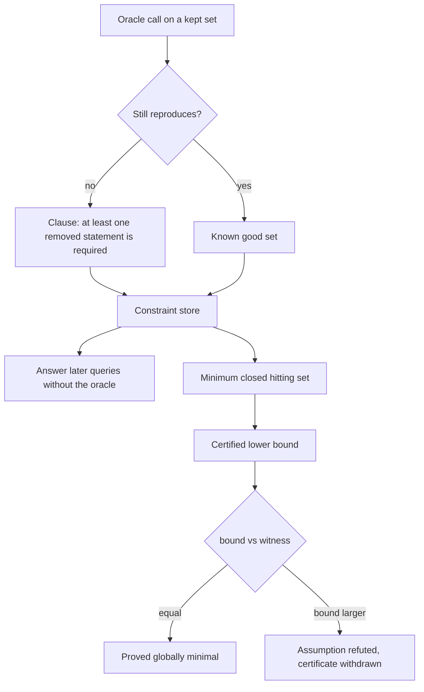
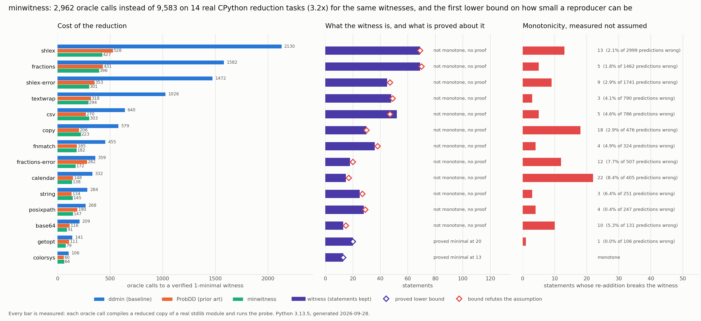

# minwitness

Program reduction that tells you how close to minimal the answer is, instead of just calling it minimal.

## The problem

When a bug report arrives as a 2,000 line file, the first job is shrinking it to the few lines that actually matter. Every tool that does this (delta debugging, `git bisect`'s cousin `ddmin`, C-Reduce, Hypothesis shrinking, `creduce`, LLVM's `bugpoint`) reports a result that is **1-minimal**: no single element can be removed without losing the bug.

Users read "1-minimal" as "minimal". It is not the same claim, and the gap is not small. 1-minimality says nothing about a smaller reproducer built from a *different* set of statements. No reducer in use today reports any lower bound at all, so there is no way to tell a 13 statement answer that is optimal from a 69 statement answer that could have been 20.

There is a second, quieter problem. The fast modern reducers (ProbDD and everything built on it) learn from failures: when deleting a chunk loses the bug, they conclude that something in that chunk is required, and they use that to steer the next deletion. That inference is only valid if reduction is **monotone**, meaning that adding statements back to a reproducing program can never stop it reproducing. Nobody has measured whether real programs are monotone. This project does, and they are not.

## What it does

`minwitness` reduces a real CPython standard library module against a one line probe, and returns three things:

1. **A witness.** The smallest reproducing program it found, verified 1-minimal against the oracle itself.
2. **A certificate.** A proved lower bound on how small *any* reproducer can be, computed as a minimum hitting set over the constraints that the oracle calls already produced. When the bound equals the witness, the witness is the global minimum and the tool says so.
3. **A verdict on its own assumption.** The bound is only valid if the program is monotone. When the bound comes out *above* the witness size, that is self-refuting and the certificate is withdrawn automatically. A sharper `add-one` probe puts single statements back into the witness and reports every one that breaks it.

The constraint store that makes the certificate possible also makes the reduction cheaper: any query whose outcome is already implied by earlier oracle calls is answered without running the oracle.



## Why it is interesting

The clause that a reducer learns from a failure ("at least one of these statements is required") is exactly a hitting set constraint. Collect them and the minimum hitting set is a lower bound on every possible reproducer, which is the certificate nobody ships. Two details make it work on real code:

* **Necessity probes are cheap and strong.** Removing a statement from the *witness* only proves it matters in that context. Removing it from the *whole program* proves it belongs to every reproducer, which is a unit clause. That costs one oracle call per surviving statement, a few percent of the run.
* **The hitting set has to respect the syntax tree.** Keeping a statement means keeping everything that encloses it, so the solver works over ancestor-closed sets. That both tightens the bound and makes the solution a legal program that can be tested directly.

The negative result is the more useful half. Monotonicity, the assumption every learning-based reducer rests on, holds on **1 of the 14 real reduction tasks measured here**. The reason is not subtle once you see it: a program is not a bag of independent parts. Putting `error = GetoptError` back into a reduced `getopt` raises `NameError`, because the reduction already deleted `GetoptError`. More program, less reproduction.

## Architecture

[FigJam board: minwitness architecture](https://www.figma.com/board/PTtI8dcCmPLSnU5k6NgUD7)

The diagram shows how one oracle call turns into either a clause or a known good set, how the constraint store uses those both to skip later oracle calls and to feed the hitting set solver, and how the resulting bound is compared against the witness to either prove minimality or refute the monotonicity assumption.

## Results



The metric is **oracle calls needed to produce a verified 1-minimal witness**. An oracle call is not simulated: it compiles a reduced copy of a real standard library module, executes it, runs the probe, and compares the outcome to the unreduced module. The baseline is `ddmin`, the algorithm every reduction tool descends from. `minwitness` is the same `ddmin` search with the constraint store answering determined queries.

Across 14 tasks built from 12 CPython 3.13.5 modules (`shlex` and `fractions` each appear twice, once for a value probe and once for an exception probe), `ddmin` needs **9,583** oracle calls and `minwitness` needs **2,962**, a **3.23x** reduction, and the two produce the same witness on 13 of the 14 tasks. The witnesses cut 3,727 statements down to 481, or 87.1 percent removed. The whole measurement is 281 seconds on one CPU.

| subject | statements | witness | ddmin | HDD | ProbDD | minwitness | vs ddmin | add-one counterexamples |
| --- | ---: | ---: | ---: | ---: | ---: | ---: | ---: | ---: |
| `shlex` | 271 | 69 | 2130 | 874 | 528 | **427** | 5.0x | 13 |
| `fractions` | 460 | 69 | 1582 | 956 | 431 | **396** | 4.0x | 5 |
| `shlex-error` | 271 | 45 | 1472 | 757 | 353 | **301** | 4.9x | 9 |
| `textwrap` | 179 | 48 | 1026 | 642 | 318 | **294** | 3.5x | 3 |
| `csv` | 264 | 52 | 640 | 612 | 270 | **303** | 2.1x | 5 |
| `copy` | 175 | 30 | 579 | 487 | 206 | **223** | 2.6x | 18 |
| `fnmatch` | 123 | 36 | 455 | 396 | 185 | **182** | 2.5x | 4 |
| `fractions-error` | 460 | 18 | 359 | 633 | 282 | **172** | 2.1x | 12 |
| `calendar` | 476 | 15 | 332 | 238 | 148 | **138** | 2.4x | 22 |
| `string` | 152 | 25 | 284 | 207 | 134 | **145** | 2.0x | 3 |
| `posixpath` | 352 | 28 | 268 | 245 | 190 | **147** | 1.8x | 4 |
| `base64` | 331 | 13 | 209 | 179 | 116 | **91** | 2.3x | 10 |
| `getopt` | 109 | 20 | 141 | 138 | 111 | **79** | 1.8x | 1 |
| `colorsys` | 104 | 13 | 106 | 88 | 60 | **64** | 1.7x | 0 |
| **total** | 3727 | 481 | 9583 | 6452 | 3332 | **2962** | 3.23x | 109 |

### Four things worth reading off that table

**The speedup is against `ddmin`, not against everything.** ProbDD already spends 3,332 calls, and adding the constraint store to ProbDD only takes it to 2,846. That is the honest shape of the result: ProbDD's soft Bayesian update is already capturing most of what the exact constraint store captures, so the store's unique contribution is the certificate, not the speed. The same store applied to HDD takes 6,452 down to 3,053.

**The store is not free.** On `csv` and `copy` and `string` it makes `minwitness` slower than plain ProbDD, and on `fractions` it returns a 69 statement witness where plain `ddmin` finds 66. The store's predictions are sound only under monotonicity, and when that fails the search is steered into a slightly worse corner. A final 1-minimality pass that bypasses the store entirely is what keeps the shipped answer correct anyway.

**Monotonicity holds on 1 of 14 tasks.** The `add-one` probe puts single statements back into the witness and finds **109** that break it, on 13 of the 14 subjects. `colorsys` is the only monotone one, and it is also one of only two subjects whose certificate survives. That is not a coincidence, it is the same fact measured twice.

**The free self-check catches most but not all of it.** Comparing the bound against the witness costs nothing and flags 12 of the 14 subjects. `getopt` slips through: no reducer's clause set happened to become inconsistent, so its certificate reads "proved minimal at 20", yet the `add-one` probe finds one statement that refutes it. A cheap check that is necessary but not sufficient is worth having, as long as it is not mistaken for a proof.

## How to run it

Python 3.10 or newer. The only dependency is matplotlib, and only for the chart.

```
pip install -r requirements.txt
```

Reduce one module against one probe. `M` is the reduced module:

```
python reduce.py --module base64 --probe "M.b85encode(b'abcdefgh')"
python reduce.py --module fractions --probe "M.Fraction('1/0')" --reducer probdd
python reduce.py --module shlex --probe "M.split('one two')" --source witness.py
```

Reproduce every number in this README and rewrite `docs/metrics.json`:

```
python demo.py
python make_chart.py
```

Hunt for monotonicity counterexamples directly:

```
python counterexample.py
python counterexample.py base64 calendar
```

Run the tests, which check the hitting set solver against brute force on 500 random instances, the AST decomposition against the original syntax tree, and every reducer against oracles whose true minimum is known:

```
python -m unittest discover -s tests
```

`python demo.py --subjects shlex csv` runs a subset and deliberately refuses to overwrite `docs/metrics.json`, so a partial run can never be mistaken for the shipped numbers.

## Example output

Reducing `base64` from 331 statements to 13, then withdrawing its own certificate:

```
$ python reduce.py --module base64 --probe "M.b85encode(b'abcdefgh')"
module     base64 (331 statements)
probe      M.b85encode(b'abcdefgh')
reference  Vb'VPa!sWoBn+'

witness    13 of 331 statements (96.1% removed)
oracle     91 calls (78 reducing, 13 certifying), 430 answered by the store
certificate  WITHDRAWN: bound 15 exceeds the 13 statement witness, so this program is not monotone
             counterexample: a 29 statement superset of the witness does not reproduce

import struct

def _85encode(b, chars, chars2, pad=False, foldnuls=False, foldspaces=False):
    words = struct.Struct('!%dI' % (len(b) // 4)).unpack(b)
    chunks = [b'z' if foldnuls and (not word) else b'y' if foldspaces and word == 538976288 else chars2[word // 614125] + chars2[word // 85 % 7225] + chars[word % 85] for word in words]
    return b''.join(chunks)
_b85alphabet = b'0123456789ABCDEFGHIJKLMNOPQRSTUVWXYZabcdefghijklmnopqrstuvwxyz!#$%&()*+-;<=>?@^_`{|}~'
_b85chars2 = None

def b85encode(b, pad=False):
    global _b85chars, _b85chars2
    if _b85chars2 is None:
        _b85chars = [bytes((i,)) for i in _b85alphabet]
        _b85chars2 = [a + b for a in _b85chars for b in _b85chars]
    return _85encode(b, _b85chars, _b85chars2, pad)
```

A subject where the certificate does hold, so the answer is provably the smallest reproducer that exists:

```
$ python reduce.py --module colorsys --probe "M.rgb_to_hsv(0.2, 0.4, 0.4)"
witness    13 of 104 statements (87.5% removed)
oracle     64 calls (51 reducing, 13 certifying), 236 answered by the store
certificate  PROVED MINIMAL: no reproducing program has fewer than 13 statements
```

And the counterexample hunt, which is the evidence behind the monotonicity claim:

```
$ python counterexample.py getopt calendar
getopt           witness= 20 of 109   one statement breakers: 1
    adding  error = GetoptError # backward compatibility
    makes the 21 statement program stop reproducing V([('-a', ''), ('-b', 'x')], [])
calendar         witness= 15 of 476   one statement breakers: 22
    adding  day_name = _localized_day('%A')
    makes the 16 statement program stop reproducing V(m_calendar.THURSDAY, 29)
```

## Notes on the measurement

* The oracle runs in a worker subprocess. Deleting a `break` turns a stdlib `while True` into a real hang, and an in-process oracle cannot escape one. Hangs are handled in two tiers: a watchdog asks the evaluating thread to stop, which CPython honours at any bytecode back edge and costs no process restart, and only a C level loop that ignores that escalates to killing the process. That took the `fnmatch` run from 77.8 s to 5.1 s.
* The soft deadline is 25x the measured time of the unreduced module, floored at 50 ms, and any verdict derived from a timeout is counted and reported rather than silently folded in.
* Every reducer shares one cache and one 1-minimality contract, so the call counts compare like for like. Counters are reset and the cache cleared between methods, so no method benefits from another's work.
* `docs/metrics.json` holds every per-subject number, including the reduced source of each witness.
